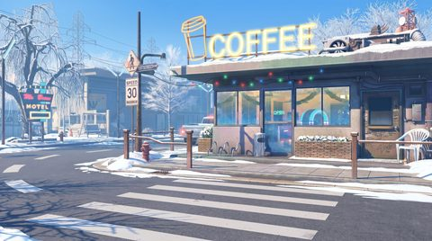
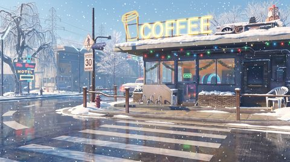
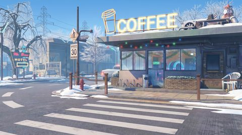
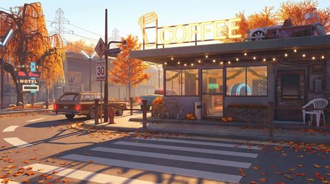

# 🖼️ Gallery — all 48 wallpapers

Every frame of the set, organised by **season × time of day × weather**. Click any thumbnail to open the full-resolution PNG.

> Generated from a single reference with Gemini 3 Pro Image. See the [slideshow video](README.md#-preview) for smooth transitions.

[← Back to README](README.md)

## ❄️ Winter / Зима

<table>
<tr><th align="center">&nbsp;</th><th align="center">Clear</th><th align="center">Cloudy</th><th align="center">Rain / Snow</th></tr>
<tr><td align="center"><b>Morning</b></td><td></td><td></td><td></td></tr>
<tr><td align="center"><b>Day</b></td><td></td><td></td><td></td></tr>
<tr><td align="center"><b>Evening</b></td><td></td><td></td><td></td></tr>
<tr><td align="center"><b>Night</b></td><td></td><td></td><td></td></tr>
</table>

## 🌸 Spring / Весна

<table>
<tr><th align="center">&nbsp;</th><th align="center">Clear</th><th align="center">Cloudy</th><th align="center">Rain / Snow</th></tr>
<tr><td align="center"><b>Morning</b></td><td></td><td></td><td></td></tr>
<tr><td align="center"><b>Day</b></td><td></td><td></td><td></td></tr>
<tr><td align="center"><b>Evening</b></td><td></td><td></td><td></td></tr>
<tr><td align="center"><b>Night</b></td><td></td><td></td><td></td></tr>
</table>

## ☀️ Summer / Літо

<table>
<tr><th align="center">&nbsp;</th><th align="center">Clear</th><th align="center">Cloudy</th><th align="center">Rain / Snow</th></tr>
<tr><td align="center"><b>Morning</b></td><td></td><td></td><td></td></tr>
<tr><td align="center"><b>Day</b></td><td></td><td></td><td></td></tr>
<tr><td align="center"><b>Evening</b></td><td></td><td></td><td></td></tr>
<tr><td align="center"><b>Night</b></td><td></td><td></td><td></td></tr>
</table>

## 🍂 Autumn / Осінь

<table>
<tr><th align="center">&nbsp;</th><th align="center">Clear</th><th align="center">Cloudy</th><th align="center">Rain / Snow</th></tr>
<tr><td align="center"><b>Morning</b></td><td></td><td></td><td></td></tr>
<tr><td align="center"><b>Day</b></td><td></td><td></td><td></td></tr>
<tr><td align="center"><b>Evening</b></td><td></td><td></td><td></td></tr>
<tr><td align="center"><b>Night</b></td><td></td><td></td><td></td></tr>
</table>
