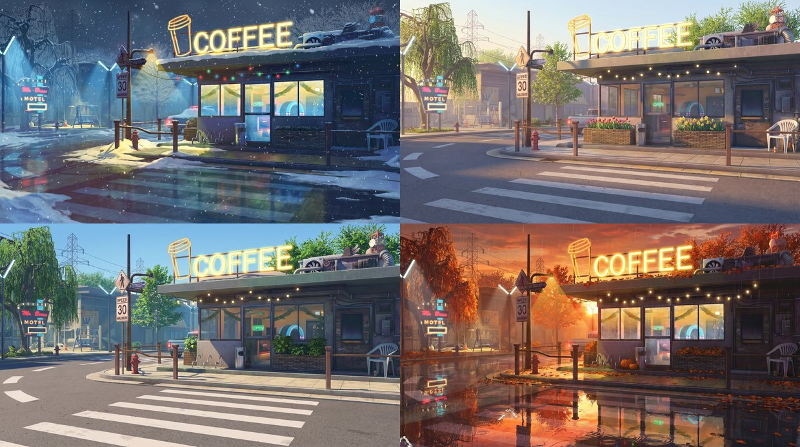
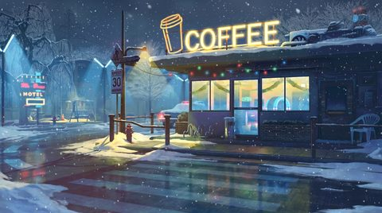
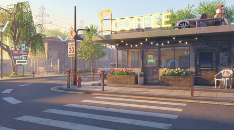
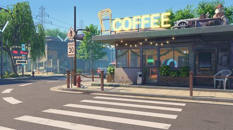
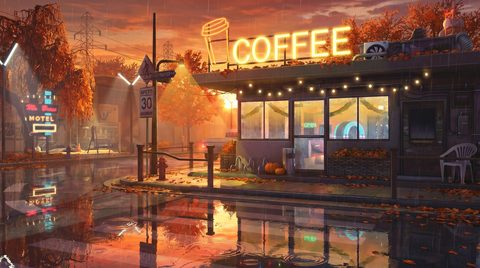
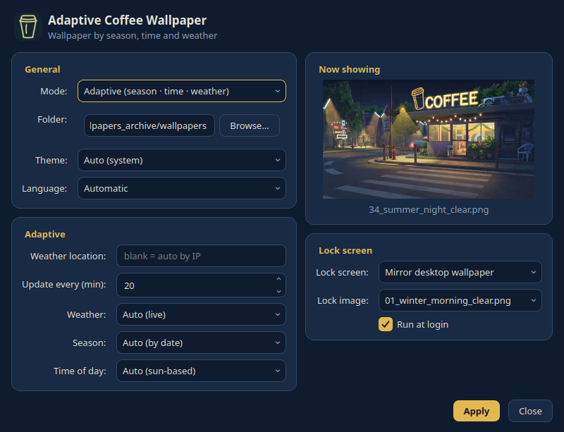
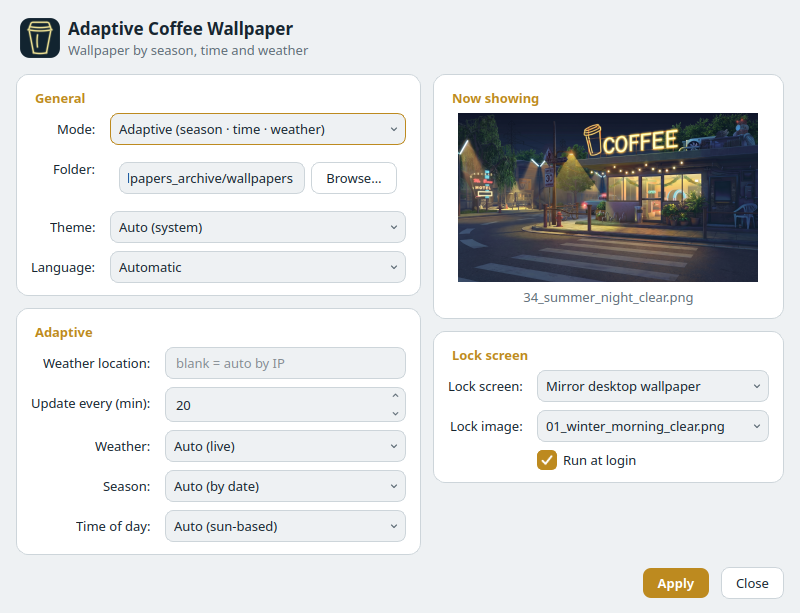

<div align="center">


# Adaptive Coffee Wallpaper

**A living "neon coffee-shop" wallpaper that changes itself with the current season, time of day and weather.**

48 frames (4 seasons × 4 times of day × 3 weather types) generated from a single
reference, plus a cross-platform app and a KDE Plasma plugin that set the right
frame automatically.

[](https://github.com/dz-vadim/adaptive-wallpapers/actions/workflows/ci.yml)
[](https://github.com/dz-vadim/adaptive-wallpapers/releases/latest)
[](https://github.com/dz-vadim/adaptive-wallpapers/releases)
[](LICENSE)


[Українська](README.md) · **English**



</div>

---

## ✨ Features

- 🌦️ **Adaptive wallpaper** — the frame is chosen by **season** (from the date),
  **time of day** (from real sunrise/sunset) and **weather** (wttr.in; a smart
  random fallback when offline).
- 🖥️ **Cross-platform app** (PyQt6) — a tray icon for **Windows, Linux
  (GNOME/XFCE/KDE/…), macOS** with smooth transitions and a live preview.
- 🧩 **KDE Plasma plugin** — a native adaptive wallpaper with crossfade.
- 🎠 **Two behaviours** — *adaptive* or *carousel* (cycle through frames).
- 🔒 **Lock screen** — keep original (with restore) / mirror desktop / pin a frame.
- 🎨 **Reference palette** — colours taken from the original artwork (night blues
  + COFFEE-neon gold); follows the **system light/dark** theme, or pick one.
- 🌐 **EN / UA** — English and Ukrainian UI (reactive).
- 📦 **Prebuilt** — Windows **setup.exe**, a portable zip, and a Linux binary.

## 🎬 Preview

▶️ **A slideshow video of all 48 frames** with smooth transitions — generate it
locally: `python scripts/make_video.py` (needs ffmpeg, [scripts/make_video.py](scripts/make_video.py)).

| ❄️ Winter · night | 🌸 Spring · morning | ☀️ Summer · day | 🍂 Autumn · evening |
|:--:|:--:|:--:|:--:|
| [](wallpapers/12_winter_night_rain_snow.png) | [](wallpapers/13_spring_morning_clear.png) | [](wallpapers/28_summer_day_clear.png) | [](wallpapers/45_autumn_evening_rain_snow.png) |

> 🖼️ **[Browse all 48 frames in the gallery →](GALLERY.md)**

## ⬇️ Install

### Windows
Download **[`adaptive-wallpaper-setup.exe`](https://github.com/dz-vadim/adaptive-wallpapers/releases/latest)**
and run it — the installer (Inno Setup, per-user, **no admin**) sets up the app,
shortcuts, optional autostart and unpacks all 48 wallpapers. Or grab the
portable `*-windows-portable.zip`.

### Linux
```bash
# prebuilt binary + wallpapers
tar xzf adaptive-wallpaper-linux.tar.gz && ./adaptive-wallpaper
# or from source
cd app && pip install PyQt6 && python -m adaptive_wallpaper
```

### KDE Plasma (native plugin)
```bash
plasma-plugin/install.sh        # install + activate
```
System Settings → Wallpaper → type **Adaptive Coffee**.

> Builds are unsigned — SmartScreen may warn (*More info → Run anyway*).
> Details: **[docs/app.md](docs/app.md)** · **[docs/windows.md](docs/windows.md)**.

## 🖥️ The app

A tray icon sets the right frame and refreshes it on a timer. Settings — mode,
folder, location, interval, manual season/time/weather override, lock screen,
theme, language — with a live preview. The theme follows the system, or you can
force light/dark.

<div align="center">

&nbsp;

</div>

```bash
python -m adaptive_wallpaper --once     # set once and exit (for schedulers)
python -m adaptive_wallpaper --install  # unpack wallpapers + autostart
```

## 🎨 How it's made

All 48 frames are generated from a **single** reference via **Gemini 3 Pro Image**
("Nano Banana Pro"), image-to-image — preserving the composition, signage and
style, changing only season/light/weather and small details.

<details>
<summary><b>Generation pipeline, models and cost</b></summary>

```
reference/_original.jpg
        │  make_reference.py   (master reference: upscale + saturation)
        ▼
reference/_reference.png
        │  generate.py         (48× season/time/weather, 2K, image-to-image)
        ▼
wallpapers/NN_<season>_<time>_<weather>.png   (01..48)
```

```fish
cp .env.example .env                                  # GEMINI_API_KEY
.venv/bin/python scripts/make_reference.py            # master reference
.venv/bin/python scripts/generate.py --test           # 3 test frames
.venv/bin/python scripts/generate.py                  # all 48 (resume-safe)
.venv/bin/python scripts/regen.py winter_night_clear  # regenerate individual
```

- **Model:** `gemini-3-pro-image` (stable id). Not flash — that softens detail.
- **Size:** `2K` (sharpness/cost sweet spot), native pixels, no upscaling.
- **Style/effects** — in `BASE_PROMPT` ([scripts/scenes.py](scripts/scenes.py)):
  wet neon reflections, bloom, volumetric light, HDR; controlled variation.
- **Reliability:** resume-safe (skips finished frames), atomic writes, retries
  with backoff, immediate stop when the quota is exhausted.

| Size | Per frame | 48 frames |
|------|-----------|-----------|
| 2K     | $0.134  | ≈ $6.4    |
| 2K batch | $0.067 | ≈ $3.2   |
| 4K     | $0.24   | ≈ $11.5   |

Full run ≈ **$7** one-off.
</details>

<details>
<summary><b>Building binaries & development</b></summary>

- App: [app/](app/) (PyQt6). Build — [docs/build.md](docs/build.md)
  (Nuitka standalone + Inno Setup `setup.exe` on Windows).
- CI: [ci.yml](.github/workflows/ci.yml) (ruff + py_compile + qmllint),
  [release.yml](.github/workflows/release.yml) (builds on a `v*` tag).
- Run from source: `cd app && pip install PyQt6 && python -m adaptive_wallpaper`.
</details>

## 📁 Structure

```
.
├── app/                  # cross-platform app (PyQt6, tray)
├── plasma-plugin/        # KDE Plasma wallpaper plugin (QML)
├── scripts/              # generation (Gemini) + make_video.py
├── wallpapers/           # 48 finished frames  →  see GALLERY.md
├── reference/            # input original + master reference
├── docs/                 # app.md · build.md · windows.md · gallery/
└── GALLERY.md            # all 48 frames in a grid
```

## 🙏 Credits

All frames are derivative works of an original coffee-shop illustration:

- **Bogdan mB0sco** — artist:
  [ArtStation](https://www.artstation.com/mb0sco) ·
  [DeviantArt](https://www.deviantart.com/mb0sco)
- **STEEZYASFUCK** — the lofi channel the artwork was made for:
  [YouTube](https://www.youtube.com/channel/UCsIg9WMfxjZZvwROleiVsQg)

## 📄 License

Code — [MIT](LICENSE). Images are derivative works of the original art (see
Credits); use them with proper attribution to the authors.
